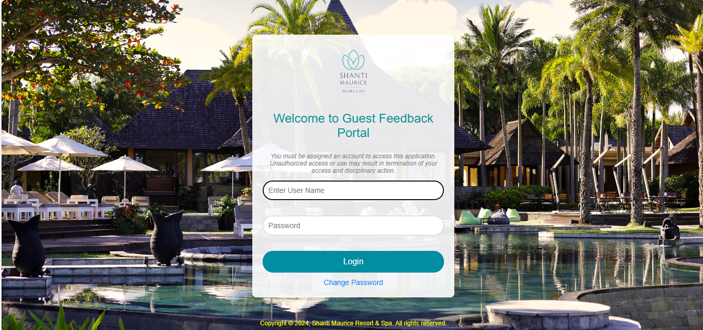
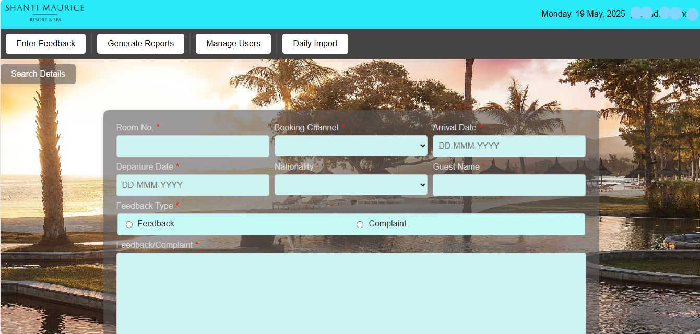
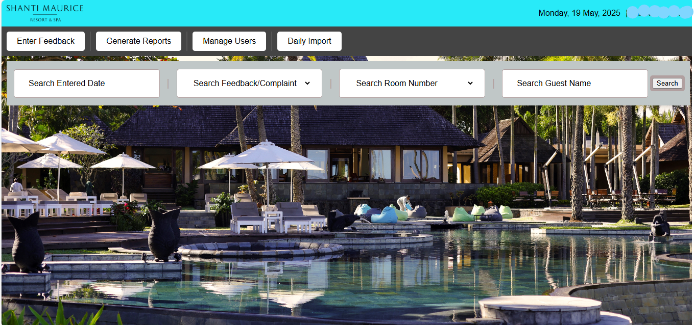
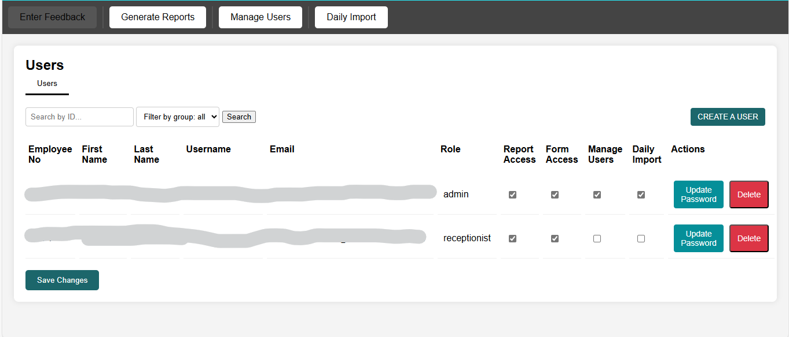
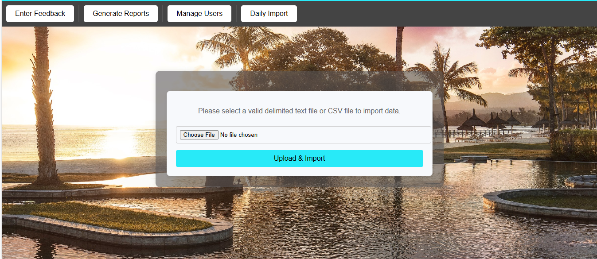

# Feedback-Management-System>

<b>Project Overview</b>

This Feedback Management System is developed for Shanti Maurice Resort & Spa in Mauritius. It allows the resort to collect, manage, and report on customer feedback efficiently. The system is designed to store customer feedback in a database, generate reports, and auto-fill existing customer details during form submissions. Additionally, it includes user management for system access.

<b>Features</b>

Customer Feedback Management - Collect and store feedback from customers.

Auto-Fill Customer Details - Automatically retrieve existing customer details from the database when filling out forms.

Report Generation - Generate detailed reports of customer feedback.

User Management - Manage system users with role-based access control.

Data Validation and Alerts - Ensure data accuracy and provide real-time alerts.

<b>Technologies Used</b>

Frontend: HTML, CSS, JavaScript

Backend: PHP

Database: MySQL

Tools: MySQL Workbench, Visual Studio Code

<b>System Architecture</b>

Client (Browser) --> Frontend (HTML, CSS, JS) --> Backend (PHP) --> Database (MySQL)

<b>Database Structure</b>

Customer Details: Stores personal and contact information.

Feedback Records: Stores feedback data, linked to customer details.

User Management: Manages user credentials and access levels.
